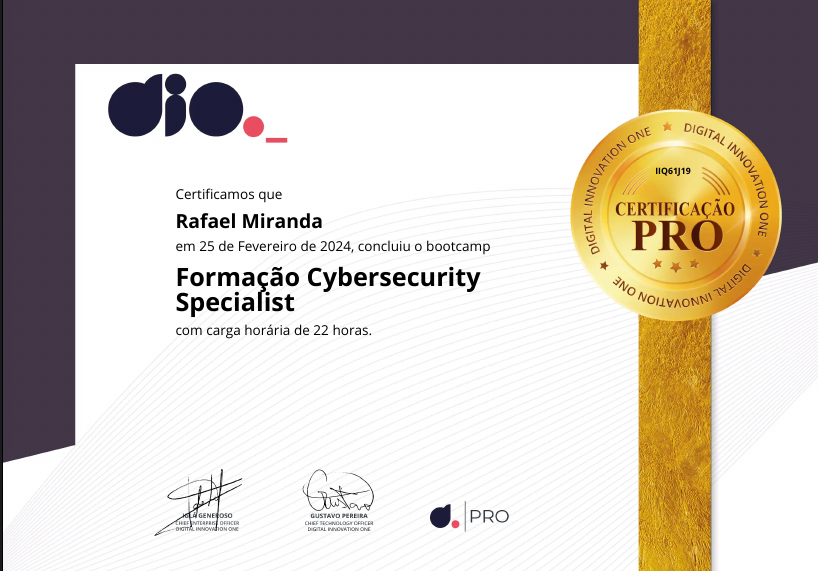

##

# Hallo! Eu sou o Raffiz, um entusiasta da tecnologia e apaixonado por desafios éticos !!! 

##

##

### - HABILIDADES -

##

### - Meu portfólio - 

(Meu portfólio está aberto, mas ainda está em processo de construção e não está totalmente finalizado.)

##

### Cursos e Formação

Busquei cursos de alta qualidade que se ajustassem ao meu orçamento e encontrei a DIO, onde me tornei PRO na plataforma. Completei diversos cursos, com destaque para o de Cybersecurity Specialist.

Atualmente, estou participando de um curso avançado em Assembly e Game Hacking. Estou totalmente dedicado ao aprendizado e ao desenvolvimento dessas habilidades. Planejo atualizar meu portfólio com os resultados desses estudos em breve. Em paralelo estou me certificando com SYCP!!!

##

### Obrigado por visitar meu perfil e dedicar um tempo para conhecê-lo. Agradeço seu interesse e espero que possamos nos conectar em breve!
